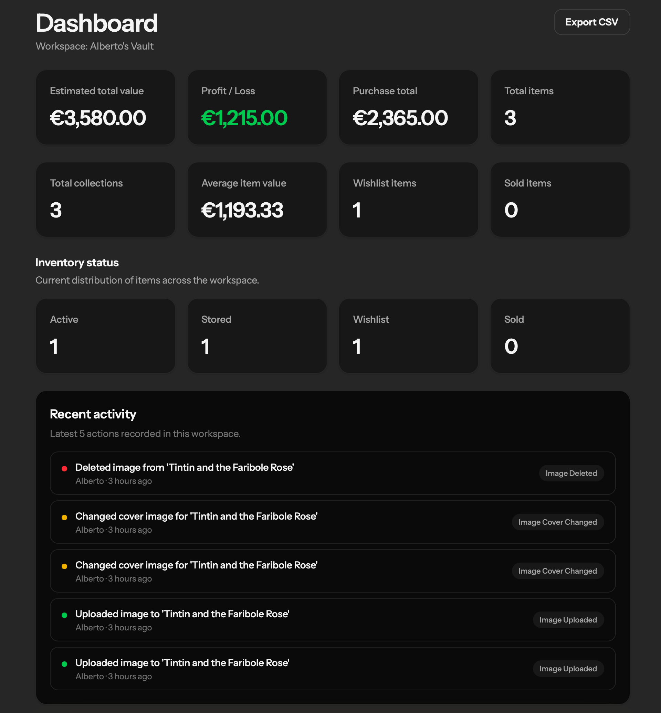
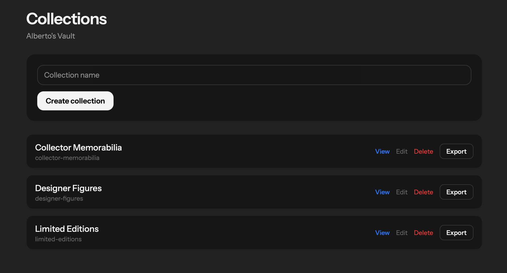
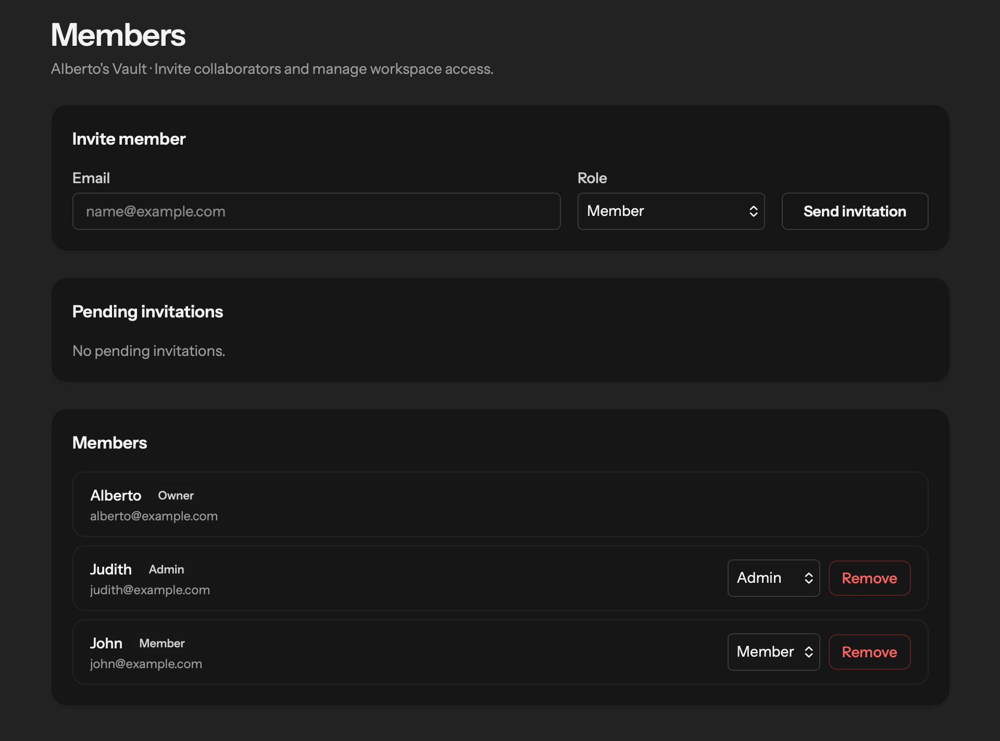

# Vaulta

**Vaulta** is a multi-tenant SaaS application designed to manage personal and professional collections with structure, scalability and collaboration in mind.

It allows users to organize items into collections, assign reusable tags, upload images, track item value, and collaborate securely within shared workspaces.

Built as a portfolio-focused SaaS project to showcase modern Laravel architecture and real-world product design patterns.

---

## 🚀 Features

* Multi-workspace system (multi-tenant architecture)
* Role-based access control (Owner, Admin, Member)
* Collections and items management
* Reusable tagging system with advanced filtering
* Image upload system with:

    * gallery management
    * cover selection
    * drag & drop reordering
* Item valuation tracking:

    * purchase price
    * estimated value
    * profit/loss calculations
* CSV export with active filters
* Activity logging system
* Responsive UI with dark mode support
* Workspace member invitations and collaboration

---

## 🧠 Technical Highlights

* Built with **Laravel 13 + Livewire**
* Clean domain-driven structure:

    * Workspace → Collections → Items
* Multi-tenant scoped architecture
* Policies & Gates for authorization
* Reactive UI powered by Livewire (without SPA complexity)
* Drag & drop image sorting
* Livewire file uploads
* Service-based activity logging
* Modular and scalable architecture
* Docker-based local development environment

---

## 📸 Screenshots

### Dashboard



### Collections



### Members & Roles



### Items Management


---

## ⚙️ Installation

```bash
git clone https://github.com/AlbertoKaz/vaulta.git

cd vaulta

docker compose up -d

docker compose exec app composer install
docker compose exec app php artisan key:generate
docker compose exec app php artisan migrate:fresh --seed
docker compose exec app php artisan storage:link
```

Then open:

```text
http://localhost
```

---

## 👤 Demo Users

| Name    | Email                                             | Password  |
| ------- | ------------------------------------------------- | --------- |
| Alberto | [alberto@example.com](mailto:alberto@example.com) | password1 |
| Judith  | [judith@example.com](mailto:judith@example.com)   | password2 |
| John    | [john@example.com](mailto:john@example.com)       | password3 |
| Lucy    | [lucy@example.com](mailto:lucy@example.com)       | password4 |
| Mike    | [mike@example.com](mailto:mike@example.com)       | password5 |

---

## 📦 Demo Data

The seeded environment includes:

* Multiple workspaces
* Shared workspace memberships
* Collections grouped by category:

    * designer figures
    * gaming
    * art
    * memorabilia
* Items with images and reusable tags
* Realistic valuation data
* Activity history examples

---

## 🧩 Project Purpose

Vaulta represents a long-term SaaS concept focused on advanced collection management.

This repository contains the **Vaulta V1 Portfolio Edition**, developed to showcase:

* Real SaaS architecture
* Multi-tenant application design
* Full-stack Laravel development
* Product-oriented backend modeling
* Reactive interfaces using Livewire

Future versions are planned with additional modules, scalability improvements and more advanced collaboration features.

---

## 📄 License

This repository is shared for portfolio and demonstration purposes only.

Vaulta is an evolving professional project and this public version represents the first portfolio release (V1).
